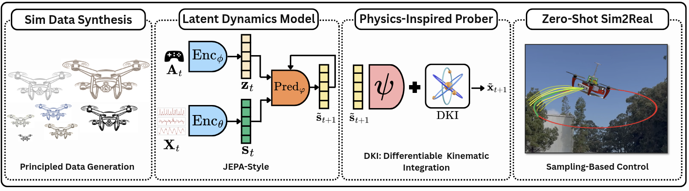
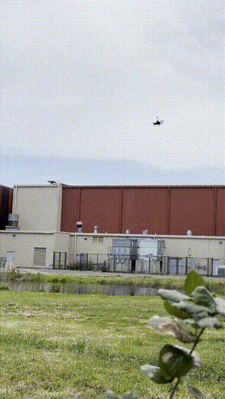
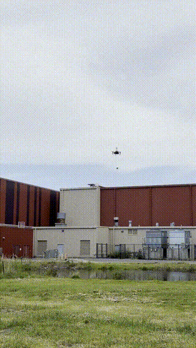
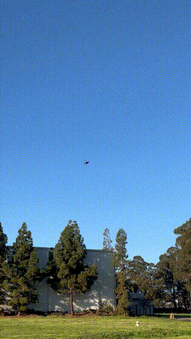

# SkyJEPA

SkyJEPA is a research project for learning latent dynamics models for aerial robots from principled simulation data and deploying them for zero-shot sim-to-real control.

The method combines JEPA-style latent prediction with a physics-inspired probing stage based on differentiable kinematic integration, enabling sampling-based control on real drone trajectories.

> Code release: the training, evaluation, and deployment code will be released soon.

## Overview

SkyJEPA follows a four-stage pipeline:

1. **Sim data synthesis**: generate structured drone dynamics data in simulation.
2. **Latent dynamics model**: learn a JEPA-style predictive representation from observations, states, and actions.
3. **Physics-inspired probe**: decode future state structure through differentiable kinematic integration.
4. **Zero-shot sim-to-real**: use the learned model for sampling-based control on real-world drone flights.

## Teasers

<table>
  <tr>
    <td align="center">
      
       
      No-payload flight 01
    </td>
    <td align="center">
      
       
      Payload flight
    </td>
    <td align="center">
      
       
      No-payload flight 02
    </td>
  </tr>
</table>

The original high-resolution teaser videos are also available in [`assets/`](assets/).

## Repository Status

This repository currently hosts the project overview and visual assets. Source code, pretrained models, dataset instructions, and reproduction scripts will be released soon.

## License

This project is released under the Apache License 2.0. See [`LICENSE`](LICENSE) for details.
